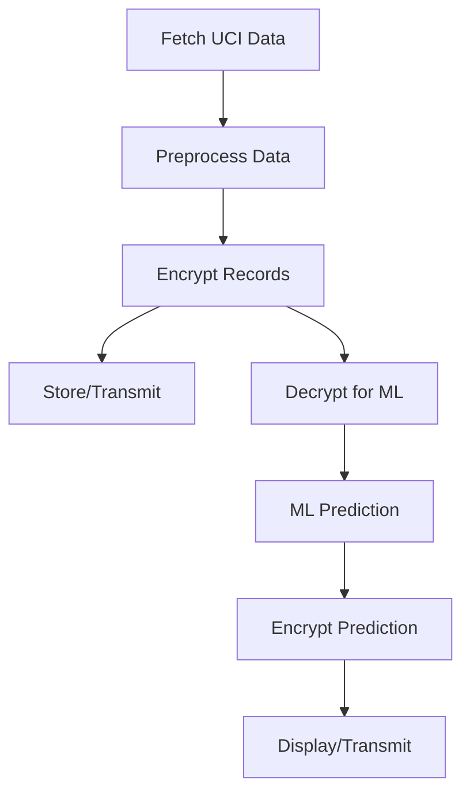

# Smart Health Monitoring System: Technical Architecture

## Overview
This system securely processes real patient vital signs (from the UCI Heart Disease dataset), predicts health risks using machine learning, and encrypts all sensitive data using AES-256.

## Modules
- **fetch_data.py**: Downloads the UCI Heart Disease dataset using `ucimlrepo`.
- **preprocessing.py**: Loads and normalizes data for ML.
- **ml_random_forest.py**: Trains and evaluates a Random Forest classifier.
- **ml_neural_net.py**: Trains and evaluates a Neural Network (MLP).
- **encryption.py**: Provides AES-256 encryption/decryption functions.
- **app.py**: Integrates all modules for secure, end-to-end workflow using real data.

## Data Flow
1. **Data Fetching**: UCI Heart Disease data is downloaded and saved as CSV.
2. **Preprocessing**: Data is normalized and prepared for ML. Features: `age`, `trestbps`, `thalach`, `chol`, `oldpeak`.
3. **Encryption**: Each patient record is encrypted before storage/transmission.
4. **Decryption**: Data is decrypted for ML prediction.
5. **ML Prediction**: Risk is predicted using Random Forest or Neural Network.
6. **Prediction Encryption**: Results can be encrypted for secure transmission.

## Security
- AES-256 encryption is used for all sensitive data fields.
- Encryption keys are generated per session and should be securely managed in production.

## Classification Note
- The `target` column in UCI Heart Disease can be multiclass (0,1,2,3,4). For binary classification, use `target > 0`.

## Example Workflow

## How to Extend
- Add real sensor integration (ESP32/Arduino)
- Deploy backend/UI on cloud or mobile
- Implement alerting (SMS/email)

---
For setup and usage, see `README.md`.
