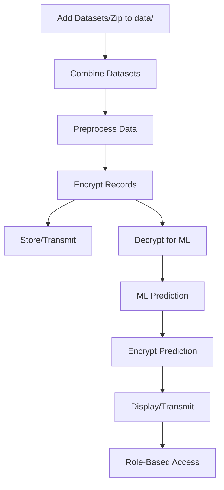

# Smart Health Monitoring System: Technical Architecture

## Overview
This system securely processes patient vital signs from multiple heart disease datasets (UCI, Kaggle, custom, zipped), predicts health risks using machine learning, and encrypts all sensitive data using AES-256. The workflow is fully automated and modular, supporting easy extension and integration.

## Modules
- **combine_datasets.py**: Automatically extracts zip files and combines all compatible CSVs in `data/` into a unified dataset (`combined_heart_disease.csv`).
- **preprocessing.py**: Cleans, normalizes, and engineers features for ML.
- **ml_random_forest.py**: Trains and evaluates a Random Forest classifier with hyperparameter tuning and class balancing.
- **ml_neural_net.py**: Trains and evaluates a Neural Network (MLP) with regularization and cross-validation.
- **ml_utils.py**: Utilities for model selection, cross-validation, and balancing.
- **encryption.py**: Provides AES-256 encryption/decryption functions for all sensitive data.
- **app.py**: Integrates all modules for secure, end-to-end workflow using the combined dataset, and saves trained models.
- **secure_report_ui.py**: Streamlit UI for role-based access, secure report submission, and real-time predictions using trained models.

## Data Flow
1. **Dataset Integration**: Place any compatible heart disease CSVs or zip files in `data/`.
2. **Combining**: `combine_datasets.py` extracts and merges all suitable CSVs into `combined_heart_disease.csv`.
3. **Preprocessing**: Data is cleaned, normalized, and engineered for ML. Features: `age`, `sex`, `trestbps`, `chol`, `thalach`, `oldpeak`, `target`.
4. **Encryption**: Each patient record is encrypted before storage/transmission.
5. **Decryption**: Data is decrypted for ML prediction.
6. **ML Prediction**: Risk is predicted using Random Forest and Neural Network models.
7. **Prediction Encryption**: Results can be encrypted for secure transmission.
8. **Role-Based Access**: UI controls access to decrypted data based on user role (Doctor, Nurse, Patient).

## Security
- AES-256 encryption is used for all sensitive data fields.
- Encryption keys are generated per session and should be securely managed in production.
- Role-based access ensures only authorized users can view decrypted data and predictions.

## Classification Note
- The `target` column in heart disease datasets may be multiclass (0,1,2,3,4). For binary classification, use `target > 0`.

## Example Workflow

## How to Extend
- Add real sensor integration (ESP32/Arduino)
- Deploy backend/UI on cloud or mobile
- Implement alerting (SMS/email)
- Integrate additional datasets by simply adding CSVs or zips to the `data/` folder
- Add new ML models or analytics modules as needed

---
For setup and usage, see `README.md`.
